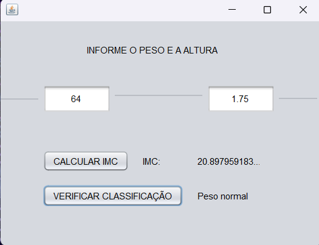

# Projeto Web Service IMC

Este projeto faz parte das atividades da matéria **WebServices**, ministrada pelo professor **Renato Fernando dos Santos**, do curso **Superior de Tecnologia em Sistemas para Internet**, 5º semestre.

O objetivo do projeto é criar um Web Service que calcula o **IMC (Índice de Massa Corporal)** e retorna a categoria de enquadramento, consumido por clientes em **Java** e **PHP**.

---

## Fórmula do IMC

$$
IMC = \frac{peso \, (kg)}{altura^2 \, (m^2)}
$$

**Categorias:**

* Abaixo do peso: IMC < 18,5
* Peso normal: 18,5 ≤ IMC ≤ 24,9
* Sobrepeso: 25,0 ≤ IMC ≤ 29,9
* Obesidade Grau I: 30,0 ≤ IMC ≤ 34,9
* Obesidade Grau II (severa): 35,0 ≤ IMC ≤ 39,9
* Obesidade Grau III (mórbida): IMC ≥ 40,0

---

## Estrutura do Projeto

O exercício 5 possui três projetos principais:

### 1. Servidor IMC (Java Maven)

* Projeto Java com Maven.

* Contém a classe `IMCWS` com dois métodos:

  1. `calcularIMC(peso, altura)`: recebe peso (kg) e altura (m) e retorna o IMC.
  2. `categoriaIMC(imc)`: recebe o IMC e retorna a categoria de enquadramento.

* Dependências no `pom.xml`:

```xml
<dependencies>
    <dependency>
        <groupId>jakarta.xml.ws</groupId>
        <artifactId>jakarta.xml.ws-api</artifactId>
        <version>4.0.2</version>
    </dependency>
    <dependency>
        <groupId>org.glassfish.metro</groupId>
        <artifactId>webservices-rt</artifactId>
        <version>3.0.2</version>
    </dependency>
    <dependency>
        <groupId>org.glassfish.hk2</groupId>
        <artifactId>hk2-api</artifactId>
        <version>3.0.2</version>
    </dependency>
    <dependency>
        <groupId>org.glassfish.hk2</groupId>
        <artifactId>hk2-utils</artifactId>
        <version>3.0.2</version>
    </dependency>
</dependencies>
```

* O WSDL do serviço fica disponível em:
  `http://localhost:8080/imcws?wsdl`

---

### 2. Cliente Java (Java with Ant)

* Projeto Java tipo **Ant**.

* Cria um **Web Service Client** usando o WSDL do servidor.

* Interface gráfica com **JFrame Form** contendo:

  * 2 campos de entrada: `Peso (kg)` e `Altura (m)`
  * 1 botão: `Calcular IMC`
  * 1 label: exibe o resultado do IMC
  * 1 label: exibe a categoria do IMC

    

* Ao clicar nos botões, o cliente realiza as requisições:

  1. Calcula o IMC com peso e altura.
  2. Consulta a categoria do IMC.

---

### 3. Cliente PHP

* Projeto PHP consumindo o mesmo Web Service.

* Executado via XAMPP (`htdocs/ClienteIMCPHP`).

* Interface web simples com:

  * Inputs: `Peso (kg)` e `Altura (m)`
  * Botão: `Calcular IMC`
  * Exibição do resultado: IMC calculado e categoria
 
    

* Utiliza `SoapClient` para consumir o Web Service.

* Corrige o retorno do SOAP acessando `$response->return`.

---

## Execução

### Servidor Java

1. Abrir o projeto Maven no NetBeans.
2. Rodar a classe `Servidor` (via NetBeans ou `mvn exec:java`).
3. Confirmar que o WSDL está acessível em `http://localhost:8080/imcws?wsdl`.

### Cliente Java

1. Abrir o projeto Ant no NetBeans.
2. Certificar-se de que o servidor está rodando.
3. Rodar a classe `IMCGUI`.
4. Inserir os valores de peso e altura e clicar em `Calcular IMC`.

### Cliente PHP

1. Colocar a pasta do cliente dentro de `htdocs` do XAMPP.
2. Abrir no navegador: `http://localhost/ClienteIMCPHP`.
3. Inserir peso e altura e submeter o formulário.
4. O resultado do IMC e a categoria serão exibidos.

---

## Observações

* Todos os projetos foram desenvolvidos como exercício de aprendizado sobre **Web Services SOAP**.
* O cliente Java e PHP consomem o serviço de forma independente.

---

Feito por **Maicon Cezar**, seguindo a orientação do professor **Renato Fernando dos Santos**.
